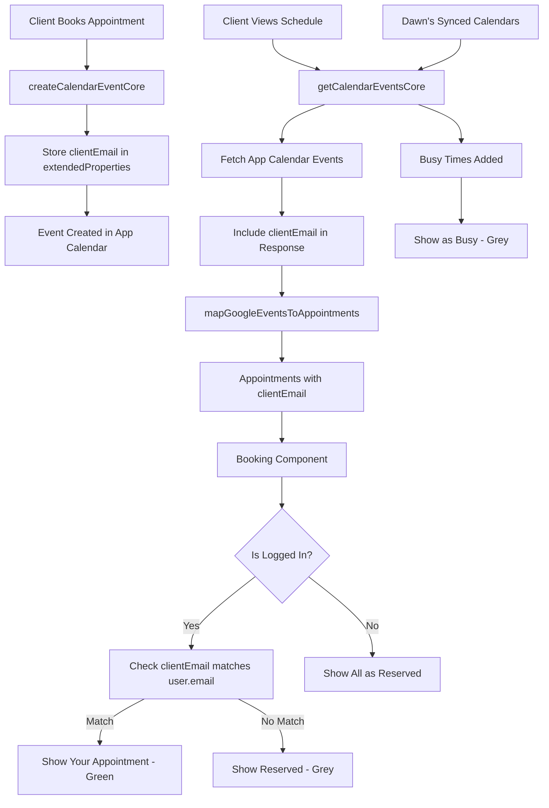

# Client Calendar Integration Plan

## Overview

When a logged-in client views the schedule, their own appointments should be displayed with distinct styling (showing them as busy) in addition to Dawn's greyed-out busy times from synced calendars.

## Current State

- Events are created with `userEmail` as an attendee, but client email is not stored in `extendedProperties`
- All appointments are treated the same - showing as "Reserved" with grey styling
- No distinction between client's own appointments and Dawn's busy times

## Implementation

### 1. Backend Changes (`functions/src/index.ts`)

#### Store Client Email in Events

- **File**: `functions/src/index.ts`
- **Function**: `createCalendarEventCore`
- **Change**: Add client email to `extendedProperties.private.clientEmail` when creating events
- **Location**: Around line 360-365, add `clientEmail: userEmail || ''` to extendedProperties
```typescript
extendedProperties: {
  private: {
    status: 'pending',
    clientEmail: userEmail || '', // Store client email for identification
  },
},
```


#### Include Client Email in Event Response

- **File**: `functions/src/index.ts`  
- **Function**: `getCalendarEventsCore`
- **Change**: Ensure client email from `extendedProperties` is included in the returned events
- **Note**: The email is already in the event object, but we should ensure it's preserved in the response

### 2. Frontend Type Updates (`types.ts`)

#### Update Appointment Interface

- **File**: `types.ts`
- **Change**: Add optional `clientEmail` field to `Appointment` interface
```typescript
export interface Appointment {
  id: string;
  clientName: string;
  service: string;
  startTime: string;
  endTime: string;
  status: "confirmed" | "pending" | "cancelled";
  clientEmail?: string; // Email of the client who booked this appointment
}
```


### 3. Frontend Service Updates (`services/calendarService.ts`)

#### Update Event Mapping

- **File**: `services/calendarService.ts`
- **Function**: `mapGoogleEventsToAppointments`
- **Change**: Extract `clientEmail` from `extendedProperties.private.clientEmail` and include it in the mapped appointment
```typescript
mapGoogleEventsToAppointments(items: GoogleCalendarEvent[]): Appointment[] {
  return items.map((item) => ({
    id: item.id || '',
    clientName: item.summary?.split(" - ")[0] || item.summary || "Private Event",
    service: item.description || "General Session",
    startTime: item.start?.dateTime || item.start?.date || new Date().toISOString(),
    endTime: item.end?.dateTime || item.end?.date || new Date().toISOString(),
    status: (item.extendedProperties?.private?.status as Appointment['status']) || "confirmed",
    clientEmail: item.extendedProperties?.private?.clientEmail, // Extract client email
  }));
}
```


### 4. Frontend Component Updates (`components/Booking.tsx`)

#### Add Client Appointment Detection

- **File**: `components/Booking.tsx`
- **Function**: Add new function `isSlotClientAppointment(day, time)` to check if a slot contains the logged-in client's appointment
- **Logic**: Check if any appointment overlaps with the slot AND has `clientEmail` matching the logged-in user's email
```typescript
const isSlotClientAppointment = (day: Date, time: string) => {
  if (!user || !user.email) return false;
  
  return appointments.some((b) => {
    if (b.clientEmail?.toLowerCase() !== user.email.toLowerCase()) return false;
    
    const bStart = new Date(b.startTime);
    const bEnd = new Date(b.endTime);
    const isSameDay = bStart.toDateString() === day.toDateString();
    if (!isSameDay) return false;

    const slotMinutes = parseTimeToMinutes(time);
    const slotEndMinutes = slotMinutes + 30;
    const bStartMinutes = bStart.getHours() * 60 + bStart.getMinutes();
    const bEndMinutes = bEnd.getHours() * 60 + bEnd.getMinutes();

    return bStartMinutes < slotEndMinutes && bEndMinutes > slotMinutes;
  });
};
```


#### Update Slot Rendering

- **File**: `components/Booking.tsx`
- **Location**: Around line 400-495 where slots are rendered
- **Changes**:

1. Call `isSlotClientAppointment()` to determine if slot is client's appointment
2. Add conditional styling for client appointments
3. Update "Reserved" text to "Your Appointment" for client's slots
4. Use different color scheme (e.g., emerald/green) for client appointments vs grey for Dawn's busy times
```typescript
const taken = isSlotTaken(day, time);
const isClientAppointment = isSlotClientAppointment(day, time);
const isDawnBusy = taken && !isClientAppointment; // Dawn's busy time if taken but not client's

// In the render:
{taken ? (
  <View style={[
    styles.takenContainer,
    isClientAppointment && styles.clientAppointmentContainer
  ]}>
    <Text style={[
      styles.takenLabel,
      isClientAppointment && styles.clientAppointmentLabel
    ]}>
      {isClientAppointment ? "Your Appointment" : "Reserved"}
    </Text>
  </View>
) : (
  // ... existing available slot UI
)}
```


#### Add New Styles

- **File**: `components/Booking.tsx`
- **Location**: In the `styles` StyleSheet
- **Add**:
- `clientAppointmentContainer`: Green/emerald background for client appointments
- `clientAppointmentLabel`: Green/emerald text color
- Update `agendaRowTaken` to have conditional styling based on whether it's client's appointment

### 5. Visual Distinction

**Dawn's Busy Times** (from synced calendars):

- Grey background (`styles.agendaRowTaken`)
- Grey text (`styles.textMuted`)
- Label: "Reserved" or "Busy"

**Client's Own Appointments**:

- Green/emerald background (new style)
- Green/emerald text
- Label: "Your Appointment"
- More prominent/visible than Dawn's busy times

## Data Flow




## Testing Checklist

- [ ] Client email is stored in event extendedProperties when booking
- [ ] Client email is included in appointment objects when fetching
- [ ] Logged-in client sees their appointments as "Your Appointment" with green styling
- [ ] Logged-in client sees other appointments as "Reserved" with grey styling
- [ ] Logged-in client sees Dawn's busy times as "Reserved" with grey styling
- [ ] Non-logged-in users see all appointments as "Reserved" (no change)
- [ ] Multiple clients can have appointments without conflicts

## Edge Cases

1. **Client books while logged out, then logs in**: Appointment won't have clientEmail, so it won't show as "Your Appointment"
2. **Client email changes**: Need to handle case where stored email doesn't match current email
3. **Multiple appointments for same client**: All should show as "Your Appointment"

## Notes

- Client email matching is case-insensitive
- Only logged-in clients see the distinction