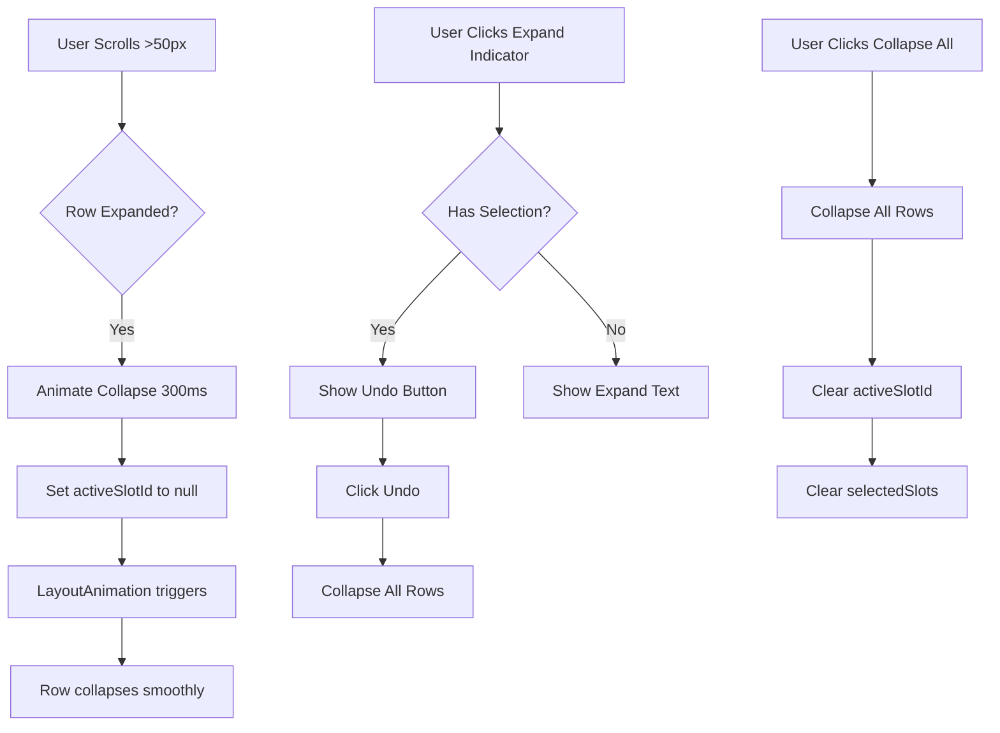

# Improve Booking Scroll Collapse and Collapse Behavior

## Overview

Improve the UX of the booking component by:

1. Animating the scroll-away collapse effect instead of sudden collapse
2. Making "Collapse Row" collapse ALL expanded appointments at once
3. Adding "Undo" functionality in the expand indicators instead of individual collapse buttons

## Current Issues

### 1. Sudden Scroll Collapse

- **Location**: `app/index.tsx` line 31-38
- **Problem**: When user scrolls >50px, `activeSlotId` is immediately set to `null`, causing instant collapse
- **Current Code**:
```typescript
const handleScroll = (event: NativeSyntheticEvent<NativeScrollEvent>) => {
  const currentY = event.nativeEvent.contentOffset.y;
  const diff = Math.abs(currentY - lastScrollY.current);
  lastScrollY.current = currentY;
  if (activeSlotId && diff > 50) {
    setActiveSlotId(null); // Instant collapse
  }
};
```


### 2. Individual Collapse Button

- **Location**: `components/Booking.tsx` line 702-709
- **Problem**: "Collapse Row" only collapses the specific row, not all expanded rows
- **Current Code**: Calls `toggleSlot(id, day, time, slots)` which only affects that slot

### 3. Missing Undo in Expand Indicators

- **Location**: `components/Booking.tsx` lines 452-456, 530-537
- **Problem**: Expand indicators show "↑ Expand" / "↓ Expand" but don't have undo functionality
- **Current Code**: Just displays text, no interaction

## Implementation Plan

### 1. Animate Scroll Collapse (`app/index.tsx`)

#### Add Animated Value for Collapse

- Import `Animated` from `react-native`
- Create an animated value to track collapse state
- Use `Animated.timing` to smoothly animate the collapse

#### Update handleScroll Function

- Instead of immediately setting `activeSlotId` to `null`, trigger an animated collapse
- Add a debounce/throttle to prevent rapid toggling
- Animate the collapse over ~300ms

**Changes**:

```typescript
import { Animated } from 'react-native';

const collapseAnim = useRef(new Animated.Value(1)).current;

const handleScroll = (event: NativeSyntheticEvent<NativeScrollEvent>) => {
  const currentY = event.nativeEvent.contentOffset.y;
  const diff = Math.abs(currentY - lastScrollY.current);
  lastScrollY.current = currentY;
  
  if (activeSlotId && diff > 50) {
    // Animate collapse
    Animated.timing(collapseAnim, {
      toValue: 0,
      duration: 300,
      useNativeDriver: false, // Height animations don't support native driver
    }).start(() => {
      setActiveSlotId(null);
      collapseAnim.setValue(1); // Reset for next expansion
    });
  }
};
```

**Note**: Since we're collapsing by setting `activeSlotId` to null, the animation might need to be handled differently. We may need to:

- Add a `isCollapsing` state
- Animate the height of expanded rows before clearing `activeSlotId`
- Or use `LayoutAnimation` with a custom configuration

### 2. Collapse All Expanded Rows (`components/Booking.tsx`)

#### Add Collapse All Function

- Create a new function `collapseAllRows()` that sets `activeSlotId` to `null`
- This will collapse all expanded rows since only one can be expanded at a time (controlled by `activeSlotId`)

#### Update Collapse Row Button

- Change the button text to "Collapse All" or "Collapse"
- Update `onPress` to call `collapseAllRows()` instead of `toggleSlot()`
- Remove the individual slot parameters since we're collapsing all

**Changes**:

```typescript
const collapseAllRows = () => {
  onSlotSelect(null);
  setSelectedSlots([]);
};

// In the render, replace the Collapse Row button:
<TouchableOpacity
  style={styles.cancelBtn}
  onPress={collapseAllRows}
>
  <Text style={styles.cancelBtnText}>
    Collapse All
  </Text>
</TouchableOpacity>
```


### 3. Add Undo in Expand Indicators (`components/Booking.tsx`)

#### Make Expand Indicators Interactive

- Convert expand indicators from `View` to `TouchableOpacity`
- Add `onPress` handler to undo the expansion
- Show "Undo" text when a row is expanded and indicators are visible

#### Update Expand Indicator Logic

- Check if there's an active selection (`selectedSlots.length > 0`)
- If expanded, show "Undo" instead of "Expand"
- Clicking undo should collapse the current selection

**Changes**:

```typescript
// In the expand indicator sections:
{(canExpandUp || canExpandDown) && selectedSlots.length > 0 ? (
  <TouchableOpacity
    style={styles.expandIndicator}
    onPress={() => {
      onSlotSelect(null);
      setSelectedSlots([]);
    }}
  >
    <Text style={styles.expandIndicatorText}>Undo</Text>
  </TouchableOpacity>
) : (
  canExpandUp && (
    <View style={styles.expandIndicator}>
      <Text style={styles.expandIndicatorText}>↑ Expand</Text>
    </View>
  )
)}
```

**Better Approach**: Show "Undo" when there's an active selection, otherwise show "Expand"

### 4. Improve Layout Animation (`components/Booking.tsx`)

#### Enhance LayoutAnimation Configuration

- Currently uses `LayoutAnimation.Presets.easeInEaseOut`
- Create a custom configuration for smoother collapse animations
- Ensure animations work for both expand and collapse

**Changes**:

```typescript
useEffect(() => {
  LayoutAnimation.configureNext({
    duration: 300,
    create: {
      type: LayoutAnimation.Types.easeInEaseOut,
      property: LayoutAnimation.Properties.opacity,
    },
    update: {
      type: LayoutAnimation.Types.easeInEaseOut,
      property: LayoutAnimation.Properties.scaleY,
    },
    delete: {
      type: LayoutAnimation.Types.easeInEaseOut,
      property: LayoutAnimation.Properties.opacity,
    },
  });
}, [selectedSlots, activeSlotId]);
```


## Implementation Details

### File: `app/index.tsx`

1. Import `Animated` from `react-native`
2. Add `collapseAnim` ref for animation tracking
3. Update `handleScroll` to animate collapse instead of instant
4. Consider adding a debounce/throttle mechanism

### File: `components/Booking.tsx`

1. Add `collapseAllRows()` function
2. Update "Collapse Row" button to "Collapse All" and call `collapseAllRows()`
3. Make expand indicators interactive with TouchableOpacity
4. Add "Undo" functionality in expand indicators
5. Enhance LayoutAnimation configuration for smoother transitions
6. Update expand indicator rendering logic to show "Undo" when appropriate

## Visual Flow




## Testing Checklist

- [ ] Scroll collapse animates smoothly over 300ms
- [ ] Scroll collapse doesn't trigger on small scrolls (<50px)
- [ ] "Collapse All" button collapses all expanded rows
- [ ] Expand indicators show "Undo" when row is expanded
- [ ] Clicking "Undo" in expand indicator collapses the row
- [ ] Expand indicators show "Expand" when no selection
- [ ] Layout animations are smooth for both expand and collapse
- [ ] Multiple rapid scrolls don't cause animation conflicts
- [ ] Collapse works correctly when multiple slots are selected

## Edge Cases

1. **Rapid Scrolling**: Add debounce to prevent animation conflicts
2. **Scroll During Animation**: Cancel ongoing animation if user scrolls again
3. **Multiple Expansions**: Only one row can be expanded at a time (already handled by `activeSlotId`)
4. **Undo During Scroll**: Undo should work even if user is scrolling

## Notes

- The collapse animation should feel natural and not jarring
- "Collapse All" is more intuitive than individual collapse buttons